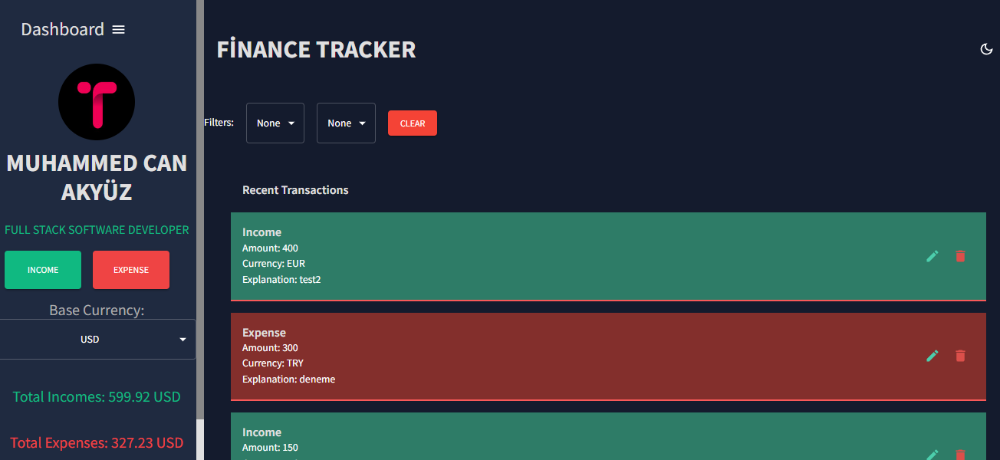
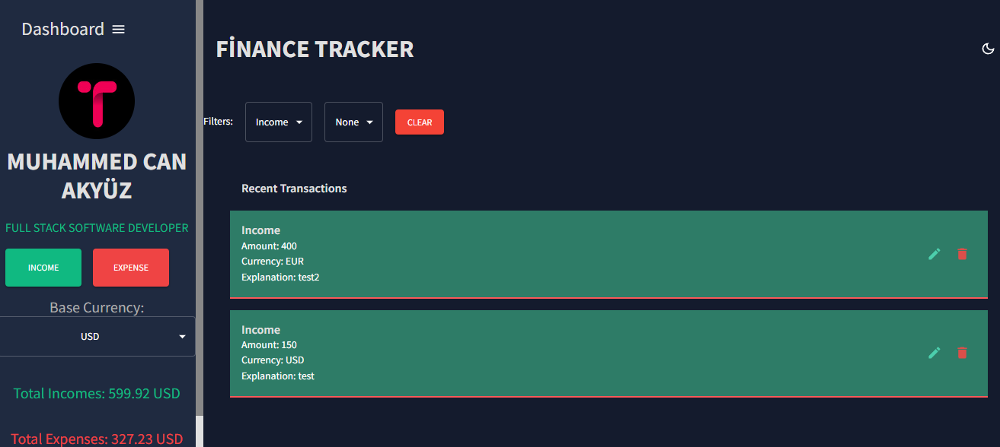
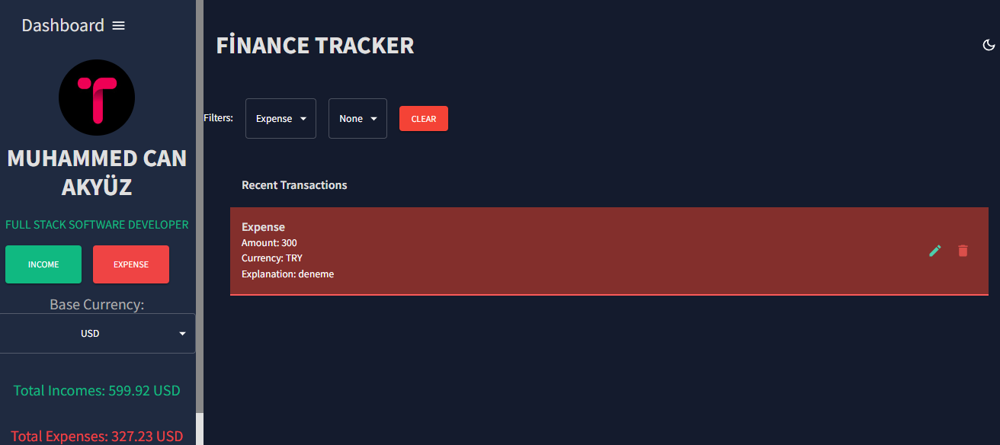
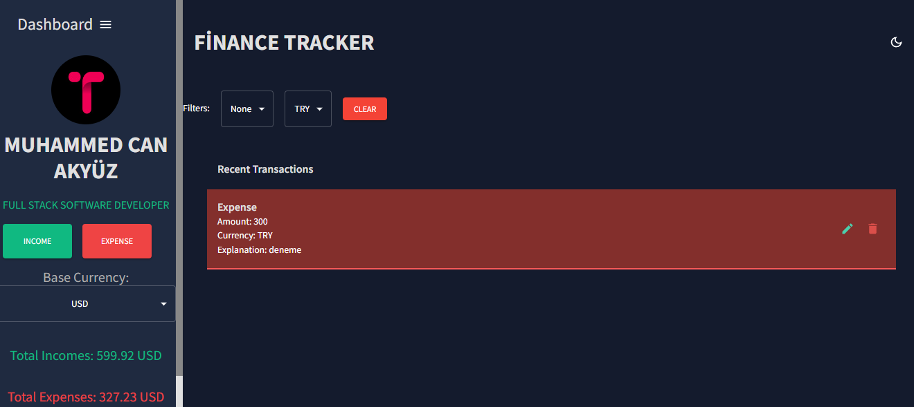
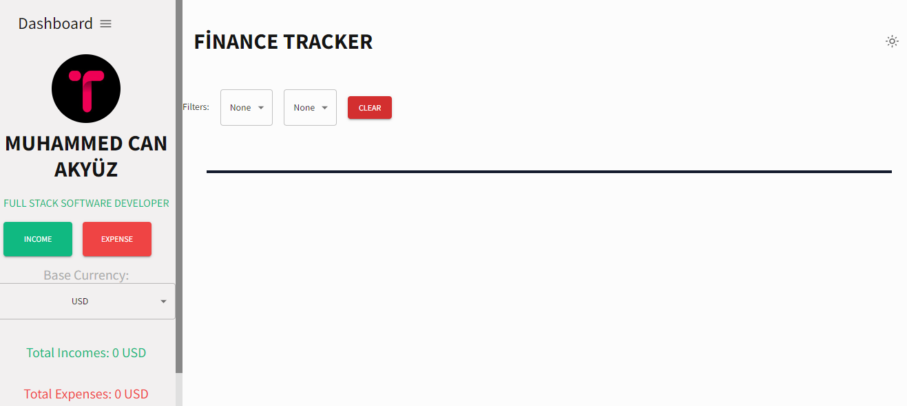

# Finance Tracker

## Installation

Use the package manager [pip](https://pip.pypa.io/en/stable/) to install foobar.

bash
git clone https://github.com/MuhammedAky/Finance-Tracker.git
cd FinanceTracker
npm install
npm run start

## Images

## License

[MIT](https://choosealicense.com/licenses/mit/)